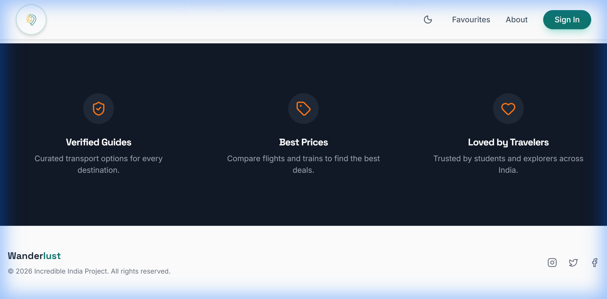

# 🌍 Wanderlust India - Premium Travel Guide

Wanderlust India is a responsive, visually immersive travel website designed to help users explore and discover India's most breathtaking destinations. Featuring a modern interface, real-time search, and a curated list of premium locations.



## ✨ Features

- **Responsive Design**: Seamless experience across desktop, tablet, and mobile devices.
- **Interactive Search**: Filter destinations instantly by name (e.g., "Taj Mahal", "Goa").
- **Dynamic Content**: Beautiful cards showcasing destinations with high-quality images and descriptions.
- **Modern UI/UX**: Clean typography, smooth transitions, and an engaging layout.

## 🛠️ Tech Stack

- **HTML5**: Semantic structure.
- **CSS3**: Custom styling, flexbox/grid layouts, and responsive media queries.
- **JavaScript**: Dynamic DOM manipulation and search logic.

## 🚀 Getting Started

1.  Clone the repository or download the source code.
2.  Open the project directory.
3.  Open `index.html` in your preferred web browser to launch the application.

## 📂 Project Structure

```text
my-project/
├── index.html       # Main HTML file
├── styles.css       # Global styles
├── script.js        # Search and interaction logic
├── auth.js          # Authentication logic
├── database.js      # Data source for destinations
├── screenshots/     # Project screenshots
└── README.md        # Project documentation
```

## 🎯 Project Objective

To demonstrate practical implementation of front-end web development concepts including:

- Responsive UI Design
- DOM Manipulation
- Event Handling
- Search Algorithms

---

_Developed for the Wanderlust Project_
